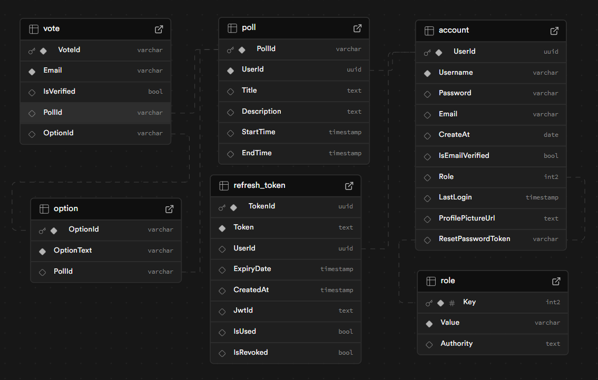

# Voting System

A web application that allows users to create and participate in polls. Built with ASP.NET C# and Supabase as the cloud database, this project aims to provide a seamless voting experience with secure authentication and real-time updates.

## Features
- User authentication (sign up, log in)
- Create polls with multiple options
- Vote on polls
- View poll results in real time
- Secure API endpoints

## Technologies Used
- **Backend:** ASP.NET Core (C#)
- **Database:** Supabase (PostgreSQL)
- **Authentication:** Supabase Auth
- **Deployment:** (Specify if applicable)

## Future Plans
- Rebuild the backend using Python, Golang, or Java
- Develop a mobile application
- Enhance security and scalability

## Databse Structure


## Getting Started
### Prerequisites
- .NET SDK (latest version)
- Supabase account and project
- PostgreSQL database set up in Supabase

### Installation
#### - Backend
1. Clone the repository:
   ```sh
   git clone https://github.com/DangKhoi14/voting_system.git
   ```
2. Navigate to the project directory:
   ```sh
   cd voting_system/voting_system_core
   ```
3. Configure Supabase connection in `appsettings.json`
4. Run the application:
   ```sh
   dotnet run
   ```
#### - Frontend
1. Navigate to the frontend directory:
   '''sh
   cd ../voting_system_webapp
   '''
2. Install dependencies:
   '''sh
   npm install
   '''
3. Start the development server:
   npm start

## Contributing
Contributions are welcome! Feel free to fork the repository and submit a pull request.

